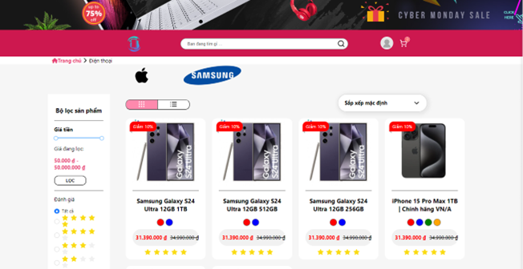
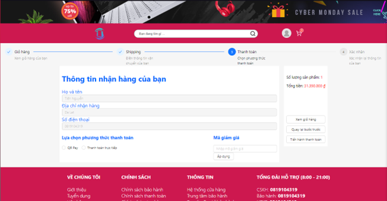

# 🛒 E-Commerce Web App

## 📚 Overview

The E-Commerce Web App is a full-stack web application designed to simulate a real-world online shopping experience. It supports features such as product browsing, cart management, order placement, user authentication, and admin product control. This project was developed as a hands-on implementation of full-stack technologies.

---

## ✔️ Features

### 👨‍🎓 User-side (Customers)

- Browse and search for products by keyword.
- View product details and categories.
- Add products to shopping cart.
- Manage cart items (update quantity, remove items).
- Register/Login using JWT authentication.
- View order history and order details.
- Update personal profile and change password
- Sending Feedback
- Rating product

### 🛡️ Admin-side

- Admin dashboard overview of total users, products, and orders.
- Manage products: add, update, delete, and upload images.
- Manage Trademarks
- Manage Categories
- Manage Feedbacks
- Manage user accounts and order statuses.
- Monitor system performance and key metrics.

---

## 🛠️ Technologies Used

- **Frontend**: ReactJS, SASS
- **Backend**: ASP.NET Core, Entity Framework Core
- **Database**: SQL Server
- **Other**: JWT Authentication, RESTful API, Redis (caching)

---

## 📊 System Highlights

- Full JWT-based authentication and role management.
- Scalable and responsive design for all devices.
- Fast product retrieval with Redis caching (<150ms response time).
- Clean architecture and well-organized API structure.
- Handles 100+ mock products and multiple user roles.

---

## 📂 Demo Screenshot

### 🛍️ Customer Pages

🔸 Home Page <br/>
 <br/>
 <br/>

🔸 Product List <br/>
 <br/>

🔸 Product Detail <br/>
 <br/>

🔸 Product Rating <br/>
 <br/>

🔸 Cart Page <br/>
 <br/>
 <br/>
 <br/>
 <br/>

🔸 Order History <br/>
 <br/>

🔸 Profile Management <br/>
 <br/>

🔸 Feedback Page <br/>
 <br/>

### 🛡️ Admin Pages

🔸 Admin Dashboard <br/>
 <br/>

🔸 Admin Profile Management <br/>
 <br/>

🔸 Manage Categories <br/>
 <br/>

🔸 Add Or Update Category <br/>
 <br/>
 <br/>

🔸 Manage Trademarks <br/>
 <br/>

🔸 Manage Sales <br/>
 <br/>

🔸 Manage Products <br/>
 <br/>
 <br/>

🔸 Add or Update Product <br/>
 <br/>
 <br/>

🔸 Manage Orders <br/>
 <br/>

🔸 Manage Coupons <br/>
 <br/>

🔸 Manage Users <br/>
 <br/>

🔸 Manage Feedbacks <br/>
 <br/>

### 🔐 Auth Pages

🔸 Login Page <br/>
 <br/>

🔸 Register Page <br/>
 <br/>

---

## 🚀 Getting Started

### 🧰 Prerequisites

Make sure the following tools are installed on your machine:

- [Visual Studio 2022](https://visualstudio.microsoft.com/)
- [Visual Studio Code](https://code.visualstudio.com/)
- [SQL Server](https://www.microsoft.com/en-us/sql-server)
- [Node.js](https://nodejs.org/)
- [Yarn](https://classic.yarnpkg.com/lang/en/docs/install/)

### ⚙️ Backend Setup (.NET Web API)

1. Navigate to the project folder:  
   `src/Server`

2. Open `Server.sln` using **Visual Studio 2022**.

3. In the Solution Explorer:

   - Right-click on `WebApi`
   - Select **"Set as Startup Project"**

4. Press `F5` or click the green ▶️ button (with **https**) to run the project.

5. The API Swagger UI should appear in your browser.

### 🌐 Frontend Setup (ReactJS)

1. Open a terminal in:  
   `src/client`

2. Run the following command to install dependencies:

   ```bash
   yarn install
   ```

   > After installation, the `node_modules` folder will be created.

3. Start the React client:

   ```bash
   yarn start
   ```

4. The app will be served at [http://localhost:3000](http://localhost:3000)

---

## 📄 Authors

- [@TienNguyen002](https://github.com/TienNguyen002)
- This project isn't deploy yet
